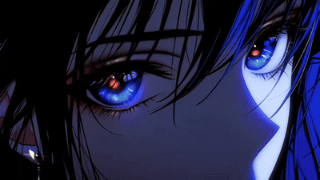

 <!--
**lem0nilvs/lem0nilvs** is a ✨ _special_ ✨ repository because its `README.md` (this file) appears on your GitHub profile.

Here are some ideas to get you started:

- 🔭 I’m currently working on ...
- 🌱 I’m currently learning ...
- 👯 I’m looking to collaborate on ...
- 🤔 I’m looking for help with ...
- 💬 Ask me about ...
- 📫 How to reach me: ...
- 😄 Pronouns: ...
- ⚡ Fun fact: ...
-->

<table>
  <tr>
    <td>
      
    </td>
    <td>
      <h2>Hello World! I'm Lem0nilovs⭐ 
      Welcome to my github Universe!</h2>
      <h3>🔗 Connect With Me</h3>
      

        
        
        
      

    </td>
  </tr>
</table>

<picture>
  <source media="(prefers-color-scheme: dark)" srcset="https://raw.githubusercontent.com/lem0nilvs/lem0nilvs/output/pacman-contribution-graph-dark.svg">
  
</picture>

####

####